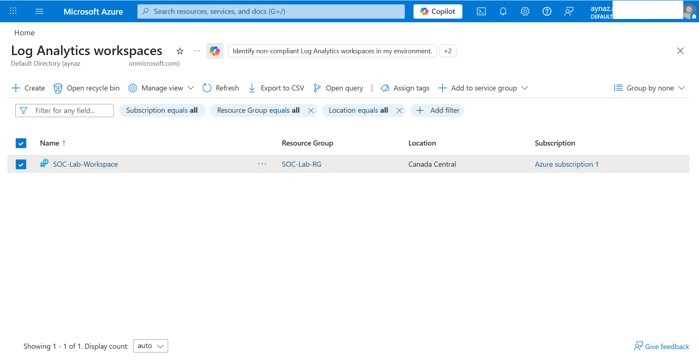
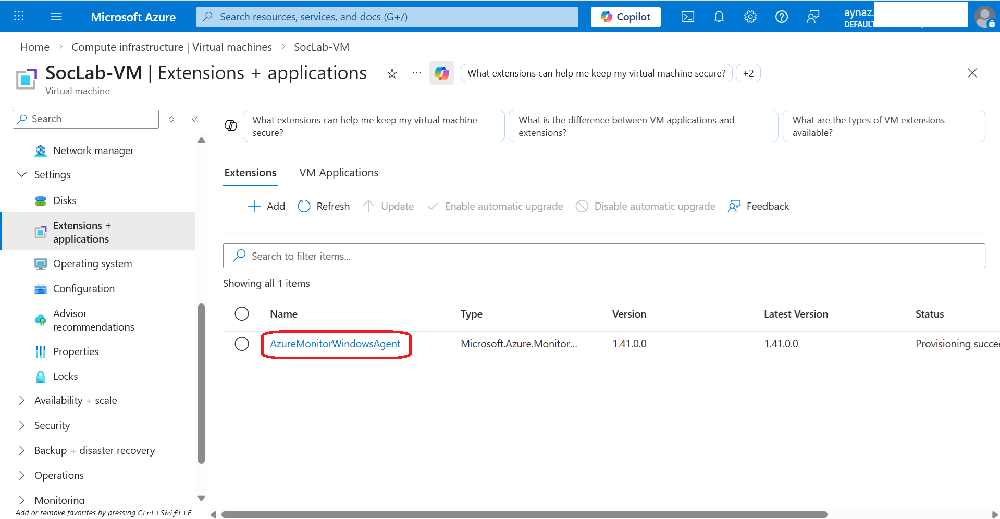
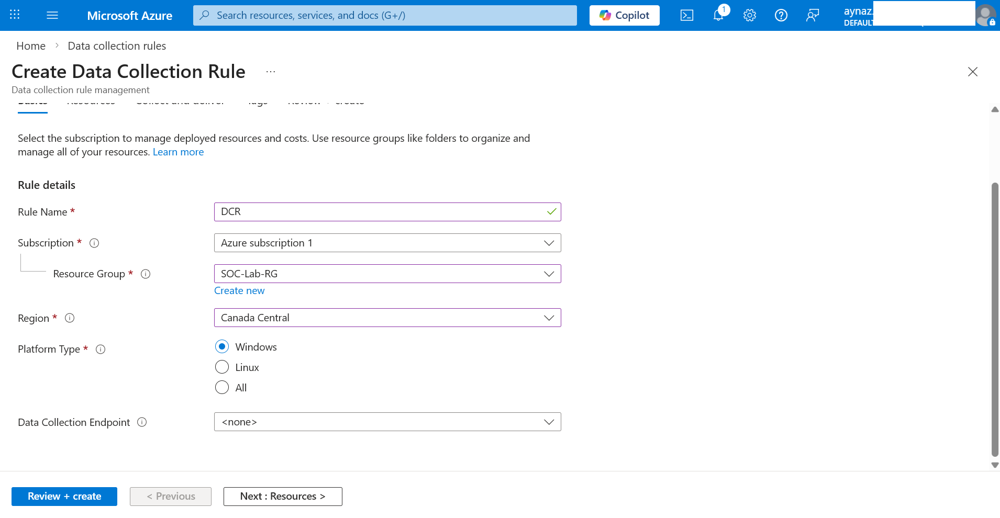
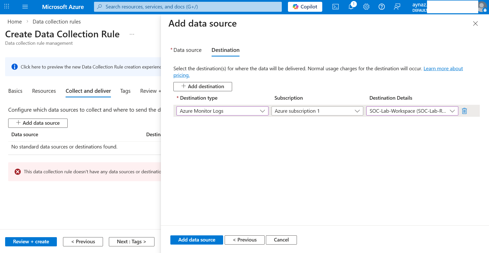
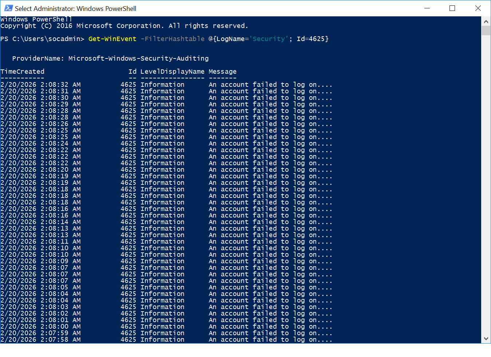
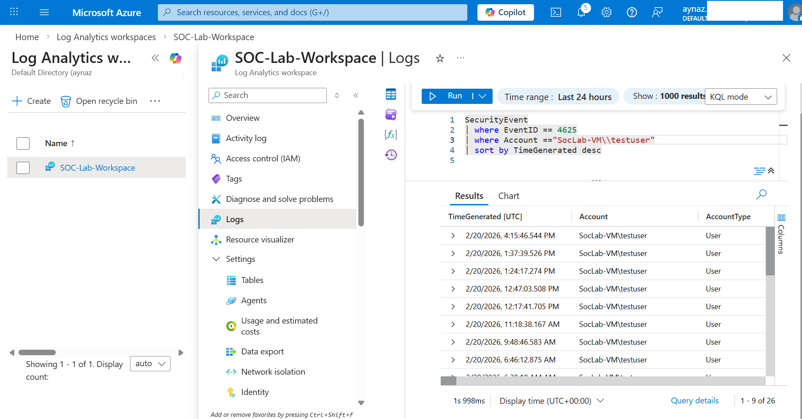
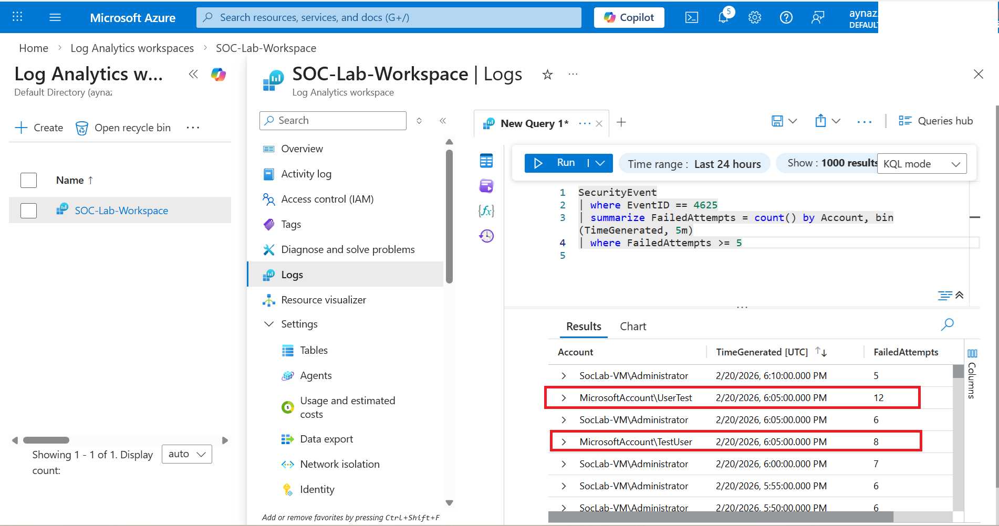
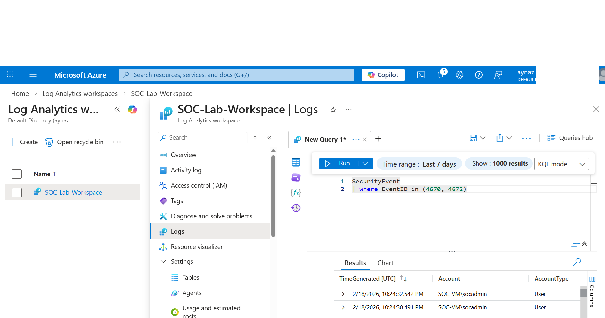

# 🛡️ Microsoft Sentinel – Brute Force Login Detection Lab

## 1️⃣ Introduction

This lab demonstrates end-to-end detection of brute-force login attempts using **Microsoft Sentinel**.  
A Windows Virtual Machine (VM) generates Security Event logs (Event ID 4625 – Failed Login). Logs are collected by **Azure Monitor Agent (AMA)**, routed via a **Data Collection Rule (DCR)**, stored in a **Log Analytics Workspace**, and analyzed in Sentinel using **analytic rules**.

**Objective:**  
Enable real-time detection of failed login attempts, simulate SOC monitoring, and map detection to the MITRE ATT&CK framework.

---

## 2️⃣ Lab Architecture

Windows Virtual Machine
↓
Windows Security Event Log
↓
Azure Monitor Agent (AMA)
↓
Data Collection Rule (DCR)
↓
Log Analytics Workspace
↓
Microsoft Sentinel
↓
Analytic Rule → Incident Creation


**Components Explained:**

- **Windows VM:** Generates security events (failed login attempts)  
- **AMA:** Collects and forwards logs from VM  
- **DCR:** Configures which logs to collect and where to send them  
- **Log Analytics Workspace:** Stores ingested telemetry  
- **Microsoft Sentinel:** SIEM platform that detects suspicious activity and generates alerts  

---

## 3️⃣ Implementation Steps

### Step 1 — Deploy Azure Resources

- Create a **Resource Group** in Azure  
- Deploy a **Windows Virtual Machine**  
- Enable **RDP access** to test login events  


---

### Step 2 — Create Log Analytics Workspace

- Create a **Log Analytics Workspace** in Azure  
- Enable **Microsoft Sentinel** for the workspace  

> The workspace serves as the central repository for ingested logs.


---

### Step 3 — Install Azure Monitor Agent (AMA)

- Add **Azure Monitor Agent** via VM → Extensions  
- Wait until **Provisioning State = Succeeded**

**AMA Responsibilities:**  
- Collect Windows Event Logs  
- Send telemetry securely to Azure Monitor  
- Forward logs to Log Analytics Workspace  

Without AMA, Sentinel cannot see the events generated on the VM.

---

### Step 4 — Configure Data Collection Rule (DCR)

- Navigate to **Azure Monitor → Data Collection Rules → Create**  
- **Data Source:** Windows Event Logs → Security  
- **Destination:** Log Analytics Workspace connected to Sentinel  
- **Target:** Select your VM  

<table>
  <tr>
    <td align="center">
      
      <br/>
      <em>Data Colection Rule - Basic</em>
    </td>
    <td align="center">
      
      <br/>
      <em>Data Colection Rule - Destination</em>
    </td>
  </tr>
</table>


**DCR Responsibilities:**  
- Define which logs to collect  
- Define where logs should be sent  
- Enable centralized log collection

Without a DCR, AMA does not know which events to forward.

---

### Step 5 — Generate Test Events

- Create a **local test account** (e.g., `SOC-Test1`) on the VM  
- Attempt **multiple failed RDP logins** (wrong password)  
- Windows generates **Event ID 4625** for each failed login  


---

### Step 6 — Verify Log Ingestion

Run the following Kusto Query in Log Analytics to confirm logs:

```kusto
SecurityEvent
| where EventID == 4625
| sort by TimeGenerated desc
```
✅ Logs should now appear, confirming AMA + DCR configuration is correct.



## 4️⃣ Create Analytic Rules (Alerts)

### 🔹 Alert 1 — Multiple Failed Logins

**Query:**

```kusto
SecurityEvent
| where EventID == 4625
| summarize FailedAttempts = count() by Account, bin(TimeGenerated, 5m)
| where FailedAttempts >= 5
```
**Rule Configuration:**

- **Frequency:** Every 5 minutes  
- **Lookup Period:** 5 minutes  
- **Severity:** Medium  
- **Incident Creation:** Enabled  

This alert triggers when an account has multiple failed login attempts within a 5-minute window.



### 🔹 Alert 2 — High-Privilege Account Usage

**Query:**
```kusto
SecurityEvent
| where EventID in (4670, 4672)
```
- **Severity:** High  
- **MITRE Tactic:** Privilege Escalation  


### 🔹 Alert 3 — Service Stops/Starts

**Query:**
```kusto
SecurityEvent
| where EventID == 7036
| summarize count() by EventData, bin(TimeGenerated, 1h)
```
- **Severity:** Medium
- **MITRE Tactic:** Defense Evasion


### Screenshots
- Log Ingestion Verification 
- Analytic Rule Setup 
- Alert Trigger / Incident 
- Workbook / Dashboard 


## 5️⃣ Triggering Alerts (Testing)

To test that your analytic rules are working in Microsoft Sentinel, perform the following steps:

### 1. Failed Login Alert
- On the VM, attempt to log in **with the wrong password 5 or more times** using the test account.  
- This should trigger the **Multiple Failed Logins** alert (Event ID 4625).

### 2. High-Privilege Alert
- Run a task as **Administrator** on the VM.  
- This should trigger the **High-Privilege Account Usage** alert (Event IDs 4670, 4672).

### 3. Service Alert
- Stop and start a Windows service manually on the VM.  
- This should trigger the **Service Stops/Starts** alert (Event ID 7036).

### 4. Verify Alerts
- Go to **Microsoft Sentinel → Incidents**.  
- Check that the alerts are generated and listed as incidents corresponding to your test actions.

## 6️⃣ MITRE ATT&CK Mapping

The following table maps the alerts created in Microsoft Sentinel to the corresponding MITRE ATT&CK tactics and techniques:

| Alert                       | Tactic                | Technique                 |
|------------------------------|---------------------|---------------------------|
| Multiple Failed Logins       | Credential Access    | T1110 – Brute Force       |
| High-Privilege Account Usage | Privilege Escalation | N/A                       |
| Service Stops/Starts         | Defense Evasion      | N/A                       |

## 7️⃣ Lessons Learned

Key takeaways from the lab:

- Modern Azure portal no longer shows old **MMA agent menus**.  
- **Workspace Keys are deprecated** → use **Managed Identity + DCR** instead.  
- Third-party extensions do **not** send logs to Microsoft Sentinel.  
- The **DCR approach** ensures secure, scalable log ingestion.  
- **KQL queries and analytic rules** allow SOC teams to detect suspicious activity in near real-time.

## 8️⃣ Key Takeaways

- **AMA:** Collects logs from VMs.  
- **DCR:** Defines what logs to collect and where.  
- **Log Analytics:** Stores logs.  
- **Sentinel:** Detects threats and generates alerts.  
- **Proper configuration** is essential for SOC operations.

## 9️⃣ Technologies Used

- **Microsoft Sentinel**  
- **Azure Monitor Agent (AMA)**  
- **Data Collection Rules (DCR)**  
- **Log Analytics Workspace**  
- **Kusto Query Language (KQL)**

## 🔟 Future Improvements

- **Add IP-based filtering** to reduce false positives.  
- **Implement alert enrichment** for more context in incidents.  
- **Add automation playbooks** to respond automatically to alerts.  
- **Tune thresholds** to reduce false positives.  
- **Extend detection** to successful login anomalies (Event ID 4624).

## 📚 References

- Microsoft. *Microsoft Sentinel Documentation*.  
  https://learn.microsoft.com/azure/sentinel/

- Microsoft. *Azure Monitor Agent Overview*.  
  https://learn.microsoft.com/azure/azure-monitor/agents/azure-monitor-agent-overview

- Microsoft. *Data Collection Rules (DCR) Documentation*.  
  https://learn.microsoft.com/azure/azure-monitor/essentials/data-collection-rule-overview

- Microsoft. *Log Analytics and Kusto Query Language (KQL)*.  
  https://learn.microsoft.com/azure/data-explorer/kusto/query/

- MITRE. *MITRE ATT&CK Framework*.  
  https://attack.mitre.org/
