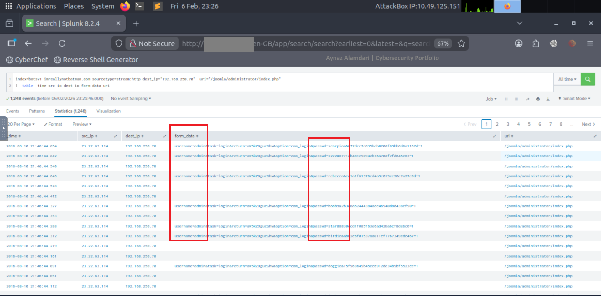

# Website Defacement – Root Cause Analysis

## Lab Context

This project is based on a simulated incident scenario and log data provided by the TryHackMe platform.  
All activity, IP addresses, and infrastructure are part of a controlled lab environment used for educational purposes.

## 1. Incident Summary
A public-facing website was reported as defaced, displaying unauthorized content.
An investigation was conducted to determine how the attacker gained access and
to identify the root cause of the compromise.

---

## 2. Investigation Objectives
- Identify when the defacement occurred
- Determine how the attacker gained access
- Identify indicators of compromise (IOCs)
- Provide remediation and prevention recommendations

---

## 3. Data Sources
- HTTP access logs
- Web server logs
- SIEM platform (Splunk)
- Sourcetype: http / web / stream:http

---

## 4. Investigation Timeline

### Step 1: Reconnaissance Phase: Identify defaced domain activity
The investigation began by searching for the domain **imreallynotbatman.com**, which the website had been redirected to. This search was performed across the web log index to identify related HTTP activity and establish a starting point for reconnaissance.


The next step was to identify the source IP address responsible for reconnaissance activity against the web server.


The source IP address was validated through analysis of Suricata-generated IDS/IPS alerts, confirming reconnaissance-related activity.
```spl 
index="botsv1" sourcetype=suricata imreallynotbatman src_ip="40.80.148.xx" ```


### Step 2: Exploitation Phase: Analyze potential exploitation attempts
The investigation focused on analyzing potential exploitation attempts against the web server to determine whether the attacker was successful.

First we want to see the number of occurrences for each source IP address with this query: 


Then this query was executed to enumerate source IP addresses associated with inbound HTTP traffic to the web server.


The http_method field provides information about the HTTP methods observed during these communications.


The src_ip results reveal that POST request activity was exclusively generated by two source IP addresses.
The following query was used to support this analysis: 
index=botsv1 sourcetype=stream:http dest_ip="192.168.250.xx" http_method=POST

The presence of Joomla in multiple web server fields indicates that the backend web application is running the Joomla CMS. The default Joomla administrative login page is located at /joomla/administrator/index.php, which provides access to the web portal’s admin interface. Traffic targeting this endpoint was analyzed to identify potential malicious activity, including possible brute‑force login attempts.
Based on the identification of the Joomla CMS and its administrative login page (`/joomla/administrator/index.php`), the investigation was scoped to examine only requests targeting this endpoint. The following search query was used to filter relevant traffic and identify potential malicious activity.


The query results indicate that the attacker from IP `23.22.63.114` attempted a brute-force attack, repeatedly trying different passwords to gain access to the administrative login.

After running several search queries, the results indicated a sustained brute-force attack originating from IP 23.22.63.114, along with a single password attempt using “batman” from IP 40.80.148.42 via a Mozilla browser.

### Step 3: Installation Phase

The investigation revealed that iamreallynotbatman.com was compromised via a brute-force attack conducted with an automated Python script. Two separate IP addresses were involved, one used to carry out the password-guessing attack and another to access the server after successful authentication. This phase examines the server for any malicious files or payloads that may have been uploaded following the compromise.

The investigation identified an .exe file present on the server, which was traced back to one of the malicious IP addresses discovered during the previous phase.


To verify if the file was executed on the server, we examined host-centric log sources for evidence of execution activity. After analyzing the search queries, we have determined that the file 3791.exe was executed on the server.

To identify the file responsible for the website defacement, Suricata network logs were analyzed to trace any suspicious traffic associated with the compromised server. The investigation began by examining Suricata as the primary log source to identify potential external communications.

Initially, no suspicious inbound connections from external IP addresses were observed. As a result, attention was shifted to outbound traffic originating from the server. Since the server is not expected to initiate outbound connections under normal conditions, any such traffic was treated as potentially malicious.

The following search query was used to identify outbound Suricata events from the server:

index=botsv1 src=192.168.250.70 sourcetype=suricata


This query revealed two suspicious destination IP addresses. Each IP address was then investigated individually. One of the suspicious destinations identified was 23.22.63.114, which was analyzed using the following query:

index=botsv1 src=192.168.250.70 sourcetype=suricata dest_ip=23.22.63.114


While reviewing the events related to this IP address, a suspicious image file was observed in the url field. To determine how this file was delivered to the server and whether it was involved in the defacement, additional searches were performed.

The following query was used to identify traffic where the server was the destination and the suspicious file was requested:

index=botsv1 url="/poisonivy-is-coming-for-you-batman.jpeg" dest_ip="192.168.250.70"
| table _time src dest_ip http.hostname url


This search provided visibility into the source of the request and the associated hostname, allowing the file’s origin and delivery path to be traced. The results indicate that the image file was externally sourced and likely related to the website defacement activity.


Before defacing the website, the attacker uploaded a malicious file to the server. During this process, the attacker used a Dynamic DNS service to mask the true source of the attack. Instead of communicating directly with a fixed IP address, the server resolved a domain name controlled by the attacker, which dynamically pointed to different IP addresses.

### Step 4: Weaponization Phase

- Investigated potential indicators of compromise by analyzing suspicious IPs and domains.
- Used **Robtex** to gather DNS and network information for the suspicious domains.
- Checked the same IPs and domains in **VirusTotal** to identify any known malicious activity.
- Documented findings to support further phases of incident handling.

The objective of this step in the investigation was to identify the actual IP address that the malicious domain resolved to at the time of the attack. By analyzing DNS-related network traffic, it is possible to determine which IP address the attacker’s Dynamic DNS domain pointed to when the file was uploaded, helping to uncover the true origin of the malicious activity.


### Step 5: Delivery Phase

Using the intelligence gathered about the adversary, we conducted proactive threat hunting across multiple Threat Intelligence and OSINT platforms. By pivoting on known Indicators of Compromise (IOCs), such as IP addresses, domains, and file hashes, we identified malware samples and infrastructure linked to the threat actor.


--------------------------------------------------------------------------

🛡️ Website Defacement – Root Cause Analysis
1. Incident Summary

A public-facing web server was reported as defaced and displaying unauthorized content.
I conducted a full investigation to determine how the attacker gained access, identify indicators of compromise (IOCs), and establish the root cause of the compromise.

2. Data Sources

HTTP access logs

Web server logs

Suricata IDS/IPS alerts

Sysmon endpoint logs

Splunk SIEM

Sourcetypes: http, web, stream:http, suricata, XmlWinEventLog

🔎 Investigation Timeline & Findings
Phase 1 – Reconnaissance

The investigation began by searching for traffic related to imreallynotbatman.com, which the website had been redirected to.

index=botsv1 imreallynotbatman.com

I then identified the source IP responsible for reconnaissance activity.

To validate the activity, I reviewed Suricata IDS alerts:

index="botsv1" sourcetype=suricata imreallynotbatman src_ip="40.80.148.xx"

Findings

IP 40.80.148.42 performed reconnaissance.

The attacker used Acunetix as a web vulnerability scanner.

Phase 2 – Exploitation

To determine if the attacker gained access, I analyzed inbound HTTP traffic.

First, I reviewed source IP occurrence counts:

Then, I examined inbound HTTP traffic to the web server:

I analyzed HTTP methods to identify abnormal POST requests:

To isolate suspicious POST requests:

index=botsv1 sourcetype=stream:http dest_ip="192.168.250.xx" http_method=POST

Since the backend application was identified as Joomla, I investigated traffic targeting the administrator login page:

index=botsv1 "/joomla/administrator/index.php"

Findings

142 brute-force attempts were observed.

IP 23.22.63.114 performed repeated password attempts.

IP 40.80.148.42 successfully authenticated.

The CMS in use was Joomla.

This confirms successful brute-force compromise.

Phase 3 – Installation

After confirming unauthorized access, I investigated whether malicious files were uploaded.

An executable file was identified:

I then verified execution using Sysmon logs.

Findings

Malicious file 3791.exe was uploaded.

Sysmon logs confirmed execution.

The MD5 hash was extracted for threat intelligence pivoting.

Phase 4 – Action on Objectives (Defacement)

Since the server should not normally initiate outbound connections, I analyzed outbound Suricata logs:

index=botsv1 src=192.168.250.70 sourcetype=suricata

This revealed suspicious external communications.

I further investigated traffic to IP 23.22.63.114:

index=botsv1 src=192.168.250.70 sourcetype=suricata dest_ip=23.22.63.114

A suspicious image file was identified:

index=botsv1 url="/poisonivy-is-coming-for-you-batman.jpeg" dest_ip="192.168.250.70"
| table _time src dest_ip http.hostname url

Findings

The file was externally sourced.

The attacker used Dynamic DNS to mask infrastructure.

The image was associated with the defacement.

Phase 5 – Weaponization & Infrastructure Analysis

I pivoted on the identified IOCs using Threat Intelligence platforms.

Indicators Investigated:

Domain: prankglassinebracket.jumpingcrab.com

IP: 23.22.63.114

Findings

Multiple masquerading domains were linked to the attacker.

The email Lillian.rose@po1s0n1vy.com
 was associated with the infrastructure.

DNS analysis revealed the true IP behind the attacker’s Dynamic DNS domain.

Phase 6 – Delivery (Secondary Payload Discovery)

Using collected intelligence, I conducted additional threat hunting.

Findings

Malware identified: MirandaTateScreensaver.scr.exe

MD5: c99131e0169171935c5ac32615ed6261

This indicates the attacker prepared a secondary payload.

🧠 Skills Demonstrated

Splunk SIEM investigation

Suricata IDS analysis

Sysmon log analysis

Brute-force detection

IOC pivoting

Threat Intelligence research

Cyber Kill Chain mapping

Root cause analysis

✅ Root Cause

The compromise occurred due to a successful brute-force attack against the Joomla administrator login page.
After authentication, the attacker uploaded and executed a malicious payload, communicated with external infrastructure using Dynamic DNS, and ultimately defaced the website.
