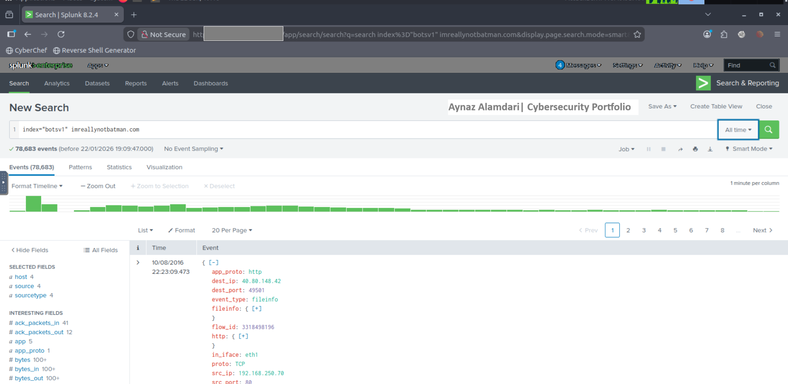
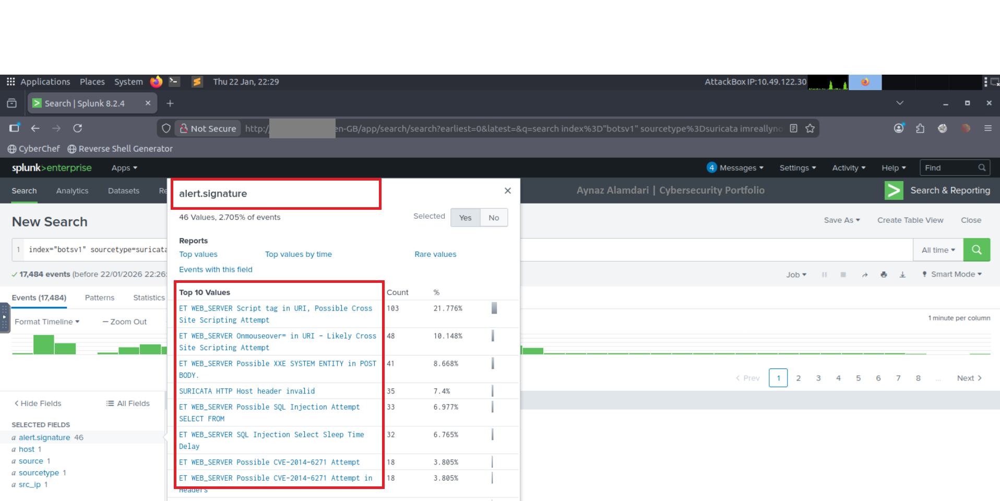
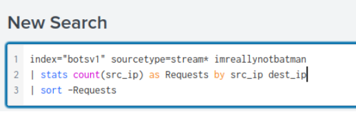

# Website Defacement – Root Cause Analysis

## Lab Context

This project is based on a simulated incident scenario and log data provided by the TryHackMe platform.  
All activity, IP addresses, and infrastructure are part of a controlled lab environment used for educational purposes.

## 1. Incident Summary
A public-facing website was reported as defaced, displaying unauthorized content.
An investigation was conducted to determine how the attacker gained access and
to identify the root cause of the compromise.

---

## 2. Investigation Objectives
- Identify when the defacement occurred
- Determine how the attacker gained access
- Identify indicators of compromise (IOCs)
- Provide remediation and prevention recommendations

---

## 3. Data Sources
- HTTP access logs
- Web server logs
- SIEM platform (Splunk)
- Sourcetype: http / web / stream:http

---

## 4. Investigation Timeline

### Step 1: Reconnaissance Phase: Identify defaced domain activity
The investigation began by searching for the domain **imreallynotbatman.com**, which the website had been redirected to. This search was performed across the web log index to identify related HTTP activity and establish a starting point for reconnaissance.

The next step was to identify the source IP address responsible for reconnaissance activity against the web server.

The source IP address was validated through analysis of Suricata-generated IDS/IPS alerts, confirming reconnaissance-related activity.
index="botsv1" sourcetype=suricata imreallynotbatman src_ip="40.80.148.xx"

### Step 2: Exploitation Phase: Analyze potential exploitation attempts
The investigation focused on analyzing potential exploitation attempts against the web server to determine whether the attacker was successful.

First we want to see the number of occurrences for each source IP address with this query: 

